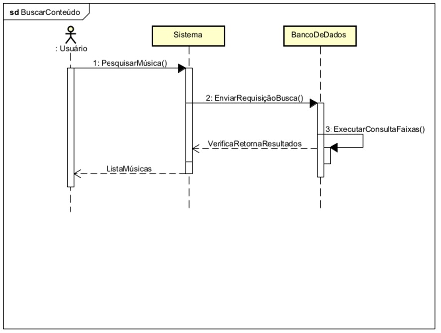
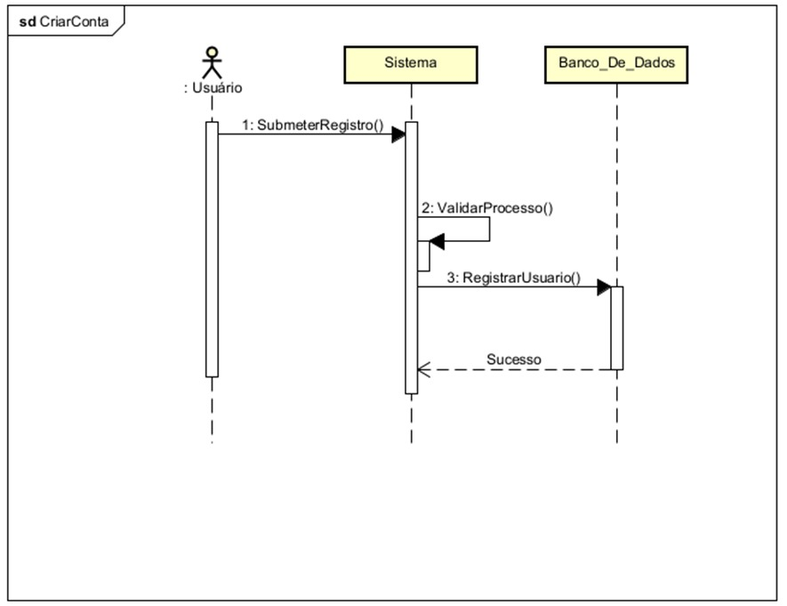
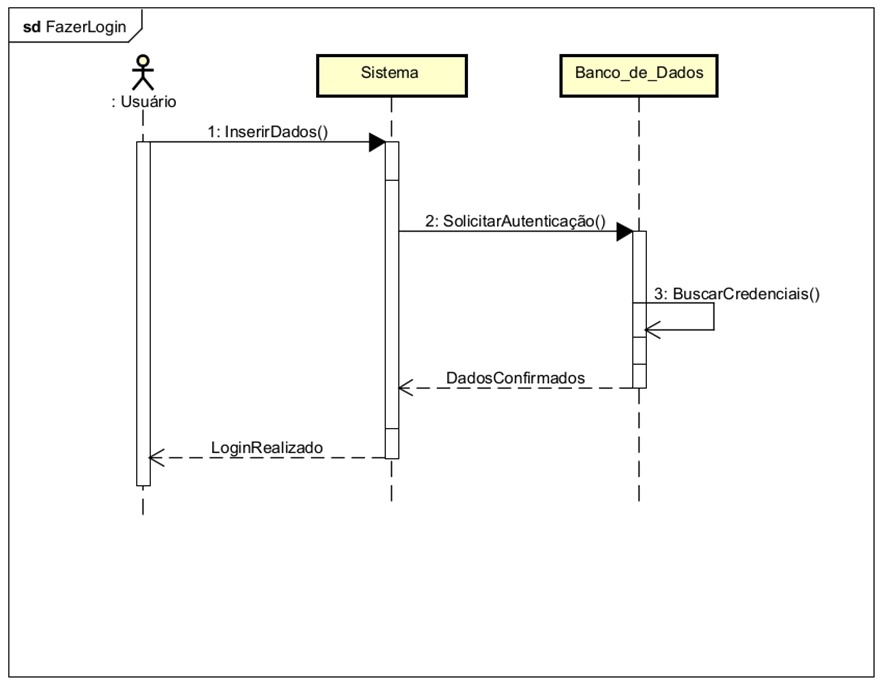
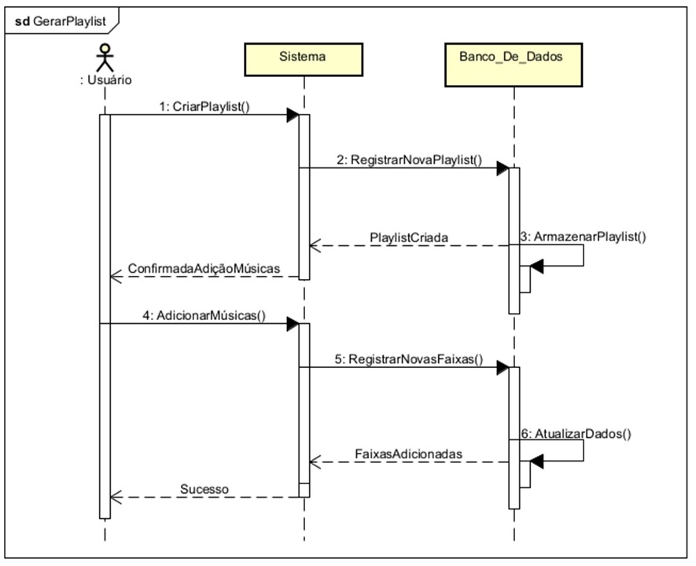
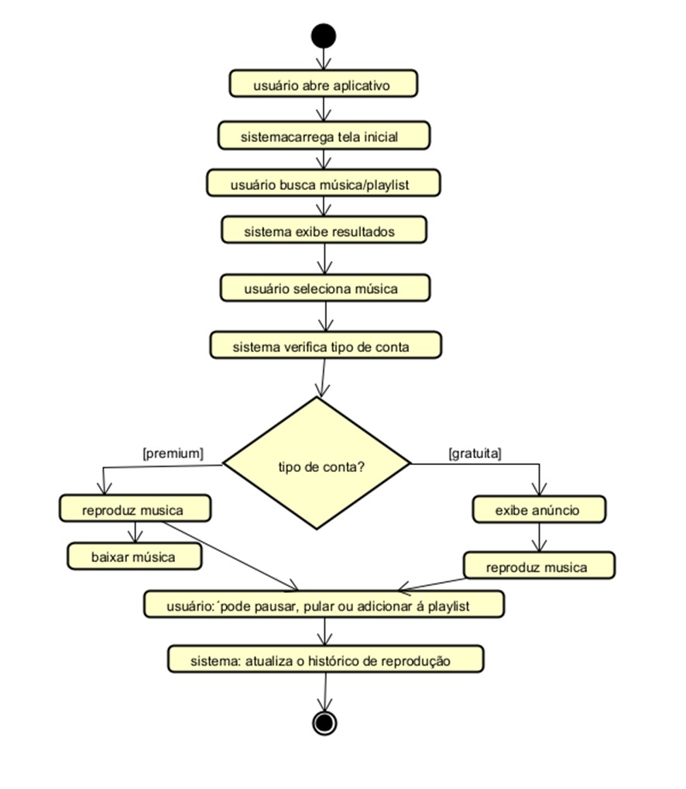

# Especificação de Requisitos do Sistema (ERS/SRS)

## Descrição Geral do Sistema
O sistema Spotify é um app de Streaming de Músicas.  
Ver como um sistema entrega estabilidade ao reproduzir músicas de forma direta e sem interrupções em servidores dedicados.

---

## Requisitos Gerais

### Requisitos Funcionais (RF)
| ID | Descrição | Prioridade |
|----|------------|-----------|
| RF01 | O sistema deve permitir que o usuário crie uma conta utilizando e-mail, senha ou login por redes sociais.|Essencial|
| RF02 | O sistema deve permitir que o usuário busque músicas, artistas, álbuns e playlists.|Essencial |
| RF03 | O sistema deve permitir a criação e edição de playlists personalizadas. | Importante |
| RF04 | O sistema deve permitir que o usuário baixe músicas para ouvir offline (função premium).|Desejável |
| RF05 | O sistema deve permitir que o usuário reproduza músicas, com opções de pausar, avançar e retroceder faixas. | Essencial |

### Requisitos Não Funcionais (RNF)
| ID | Descrição | Prioridade |
|----|------------|-----------|
| RNF01 | O sistema deve permanecer disponível 99,9% do tempo, garantindo acesso contínuo às músicas e playlists. | Essencial |
| RNF02 | O sistema deve responder às ações do usuário em até 2 segundos. | Importante |
| RNF03 | O sistema deve criptografar todas as senhas dos usuários utilizando o algoritmo SHA-256.| Essencial |
| RNF04 | O sistema deve ser compatível com dispositivos Android, iOS e versão Web. | Importante |
| RNF05 | O sistema deve possuir interface intuitiva, responsiva e com suporte ao modo escuro.| Desejável |

### Regras de Negócio (RN)
| ID | Descrição | Prioridade |
|----|------------| -----------|
| RN01 | Apenas usuários premium podem baixar músicas para ouvir offline. | Essencial |
| RN02 | Usuários do plano gratuito devem ouvir anúncios de áudio entre as músicas. | Importante |
| RN03 | Usuários gratuitos podem pular no máximo 6 músicas por hora. | Importante |
| RN04 | Playlists públicas podem ser seguidas por outros usuários, mas somente o criador pode editá-las. | Desejável |
| RN05 | O sistema deve oferecer planos premium personalizados com base no comportamento de uso do usuário. | Desejável |

---

## Diagramas UML

### Diagrama de Casos de Uso

### Diagrama de Sequência

.jpeg)

### Diagrama de Atividades

---

## Arquitetura do Sistema
O sistema adota o estilo arquitetural **MVC (Model–View–Controller)**, separando responsabilidades entre:
- **Model:** lógica e acesso a dados.  
- **View:** interface e interação com o usuário.  
- **Controller:** coordenação entre as camadas.

- 
